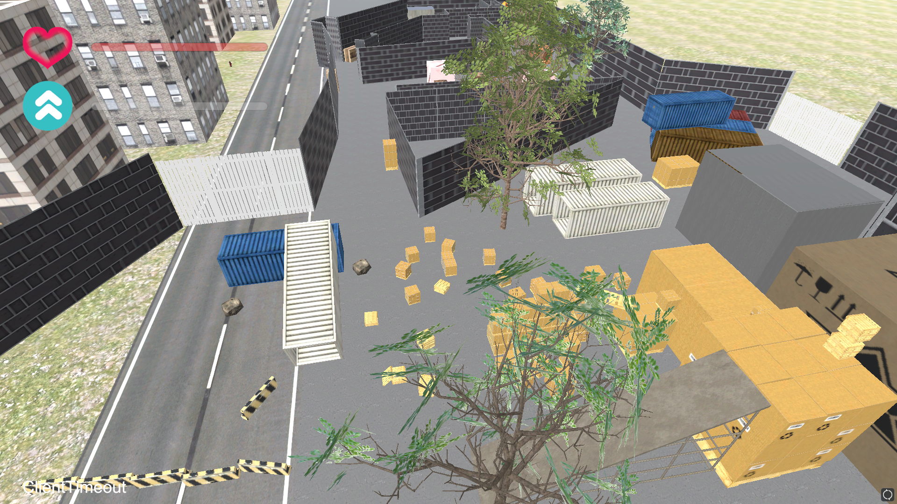
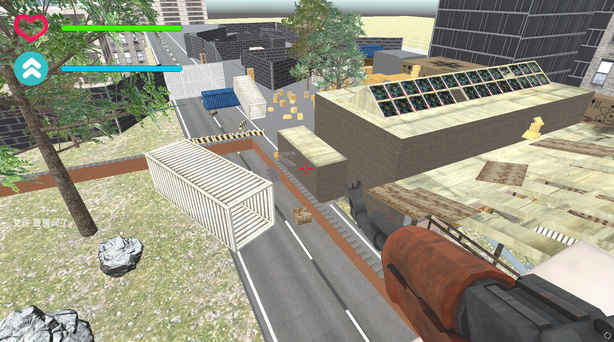
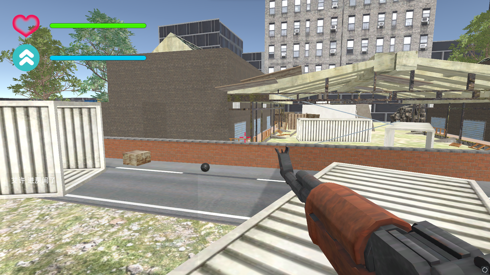
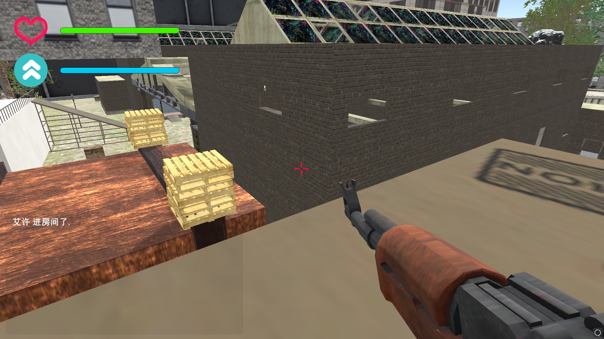
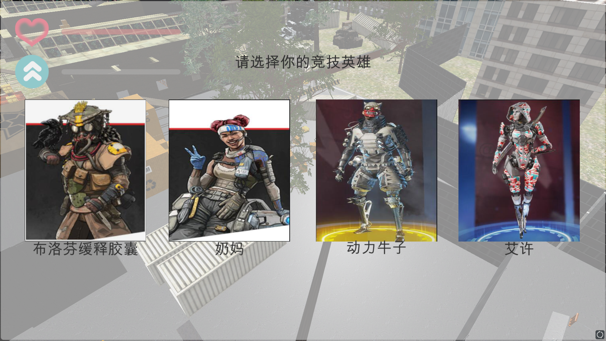
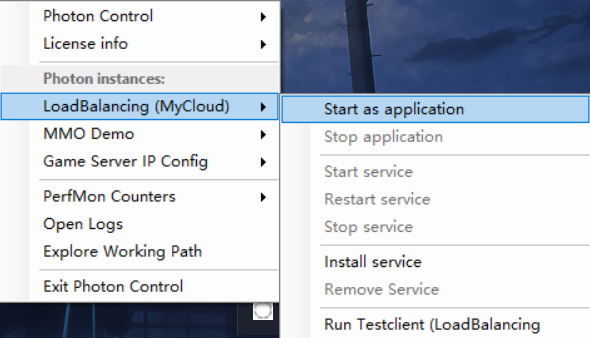

# Multiplayer-FPS
记录一下游戏课大作业  
* 由于我和几个室友都是fps玩家,所以游戏课决定整一个fps出来  
* 游戏灵感来自于apex和csgo  
* 各种素材均来自unity商店免费素材
* 我负责人物技能脚本的编写以及声音,代码合并等各种杂项,室友负责地图建模以及部分UI的制作
* 由于是多人合作,源代码可能存在*拼音变量名*,*中文文件名*等,将就一下了
## Unity版本
[Unity 2020.3.21f1 (LTS)](https://unity3d.com/unity/whats-new/2020.3.21)
## 截图
* </img>
* </img>
* </img>
* </img>
* </img>
## How to run
* 在Unity中build后,如果需要局域网联机,则需要使用PhotonServer开服(需要提前在`/Assets/Photon/PhotonUnityNetworking/Resources/PhotonServerSettings.asset`改ip为本机ip)
  * </img>
* 否则,按照[原仓库](https://github.com/Armour/Multiplayer-FPS)的设置来,可以不用PhotonServer开服